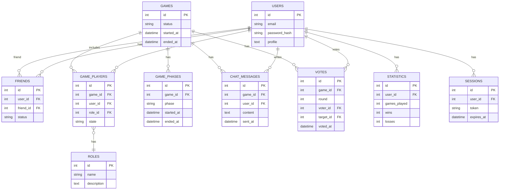

# DB ER図（Mermaid形式）

> ⚠️ **アーカイブ済み（2026-08-16）**: 初期案。ワードウルフ向けの更新版
> `docs/architecture/db-wwolf-er-mermaid.md`（PR #4でレビュー中）に置き換え。

以下はWeb人狼ゲーム用データベースのER図です。

```mermaid
erDiagram
    USERS {
        int id PK
        string email
        string password_hash
        text profile
    }
    FRIENDS {
        int id PK
        int user_id FK
        int friend_id FK
        string status
    }
    GAMES {
        int id PK
        string status
        datetime started_at
        datetime ended_at
    }
    GAME_PLAYERS {
        int id PK
        int game_id FK
        int user_id FK
        int role_id FK
        string state
    }
    GAME_PHASES {
        int id PK
        int game_id FK
        string phase
        datetime started_at
        datetime ended_at
    }
    CHAT_MESSAGES {
        int id PK
        int game_id FK
        int user_id FK
        text content
        datetime sent_at
    }
    VOTES {
        int id PK
        int game_id FK
        int round
        int voter_id FK
        int target_id FK
        datetime voted_at
    }
    ROLES {
        int id PK
        string name
        text description
    }
    STATISTICS {
        int id PK
        int user_id FK
        int games_played
        int wins
        int losses
    }
    SESSIONS {
        int id PK
        int user_id FK
        string token
        datetime expires_at
    }

    USERS ||--o{ FRIENDS : has
    USERS ||--o{ GAME_PLAYERS : participates
    USERS ||--o{ CHAT_MESSAGES : writes
    USERS ||--o{ VOTES : votes
    USERS ||--o{ STATISTICS : has
    USERS ||--o{ SESSIONS : has
    FRIENDS }o--|| USERS : "friend"
    GAMES ||--o{ GAME_PLAYERS : includes
    GAMES ||--o{ GAME_PHASES : has
    GAMES ||--o{ CHAT_MESSAGES : has
    GAMES ||--o{ VOTES : has
    GAME_PLAYERS }o--|| ROLES : "has"
```
