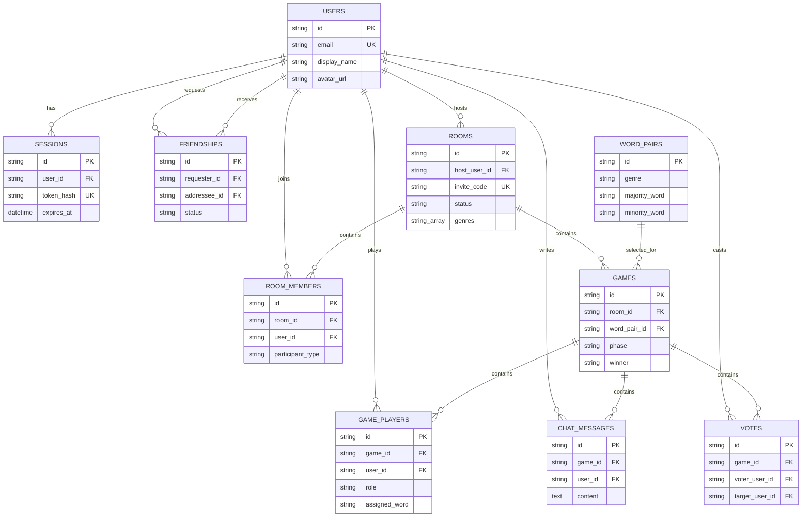

# DB ER図

```mermaid
erDiagram
    USERS ||--o{ SESSIONS : has
    USERS ||--o{ FRIENDSHIPS : requests
    USERS ||--o{ FRIENDSHIPS : receives
    USERS ||--o{ ROOMS : hosts
    USERS ||--o{ ROOM_MEMBERS : joins
    USERS ||--o{ GAME_PLAYERS : plays
    USERS ||--o{ CHAT_MESSAGES : writes
    USERS ||--o{ VOTES : casts
    ROOMS ||--o{ ROOM_MEMBERS : contains
    ROOMS ||--o{ GAMES : contains
    WORD_PAIRS ||--o{ GAMES : selected_for
    GAMES ||--o{ GAME_PLAYERS : contains
    GAMES ||--o{ CHAT_MESSAGES : contains
    GAMES ||--o{ VOTES : contains

    USERS {
        string id PK
        string email UK
        string display_name
        string avatar_url
    }
    SESSIONS {
        string id PK
        string user_id FK
        string token_hash UK
        datetime expires_at
    }
    FRIENDSHIPS {
        string id PK
        string requester_id FK
        string addressee_id FK
        string status
    }
    ROOMS {
        string id PK
        string host_user_id FK
        string invite_code UK
        string status
        string_array genres
    }
    ROOM_MEMBERS {
        string id PK
        string room_id FK
        string user_id FK
        string participant_type
    }
    WORD_PAIRS {
        string id PK
        string genre
        string majority_word
        string minority_word
    }
    GAMES {
        string id PK
        string room_id FK
        string word_pair_id FK
        string phase
        string winner
    }
    GAME_PLAYERS {
        string id PK
        string game_id FK
        string user_id FK
        string role
        string assigned_word
    }
    CHAT_MESSAGES {
        string id PK
        string game_id FK
        string user_id FK
        text content
    }
    VOTES {
        string id PK
        string game_id FK
        string voter_user_id FK
        string target_user_id FK
    }
```
