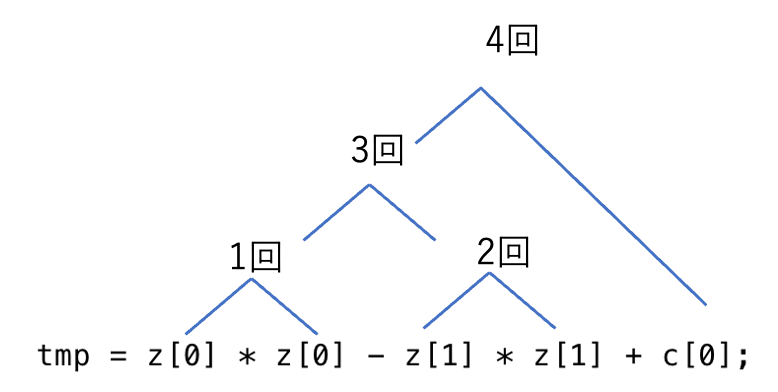
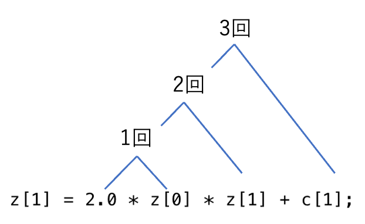

https://zenn.dev/grigri_grin/articles/5d201067dedfdb

https://harm-smits.github.io/42docs/libs/minilibx/getting_started.html

https://medium.com/@leogaudin/fract-ol-creating-graphically-beautiful-fractals-6664b6b045b5

https://qst0.github.io/ft_libgfx/man_mlx.html

https://qst0.github.io/ft_libgfx/man_mlx_new_window.html

https://jun-networks.hatenablog.com/entry/2021/06/12/170030

### Makefile
-lは、 /usr/bin or /bin の中のライブラリファイルを参照するコマンド。
-lX11と記述すると、 /usr/binのX11ライブラリを参照するという意味になる。

-Lは、探索するライブラリディレクトリの位置を変更する。

-L$(MLX_DIR)は、MLX_DIRのpathを追加で探索することになる。 `-L$(MLX_DIR) -lmlx` は、 MLX_DIRのpathと標準ライブラリから mlxから始まるライブラリを探すことになる。

```
libファイルとは
libファイルはプログラミングにおいて重要な役割を果たす静的ライブラリファイルの一種です。これらのファイルは複数のオブジェクトファイル(.oファイル)をアーカイブ化し、再利用可能なコードの形でまとめたものです。

静的ライブラリはコンパイル時にプログラムにリンクされ、実行ファイルに組み込まれます。これにより、プログラムの実行に必要なコードが1つのファイルにまとめられ、効率的な実行が可能になります。

libファイルはUnixやLinuxシステムで広く使用されている形式ですが、他のオペレーティングシステムでも同様の概念が存在します。これらのファイルは一般的に「lib」という接頭辞が付けられ、拡張子は「.a」となります。

プログラマは自分で作成したコードを静的ライブラリとしてコンパイルし、libファイルを生成することができます。これにより、コードの再利用性が高まり、開発の効率化が図れます。

libファイルを使用する際は適切なヘッダファイル(.hファイル)とともにインクルードする必要があります。ヘッダファイルにはライブラリ内の関数や変数の宣言が含まれており、プログラムがライブラリを正しく利用できるようにします

https://xexeq.jp/blogs/media/it-glossary725
```

### ft_atof
```c
int atof(const char *nptr);

引数	nptr … double型に変換する文字列のポインタ
戻り値	成功：変換後の実数（double型）
失敗：0

引数の文字列のはじめの数値部分(数値として解釈できない空白以外の文字の直前までの部分)をdouble型に変換する。
浮動小数点定数として認識できない文字列を与えた場合、または、doubleの範囲に収まらない文字列を与えた場合の動作は未定義である。
```

```c
浮動小数点数型について

浮動小数点数型とは、小数を扱うデータ型。
浮動小数点数は符号部と固定長の仮数部と固定長の指数部を持つ。数値の絶対値は以下のように定義される。

仮数 × 基数の指数乗

基数は固定されているので、仮数と指数によって小数の絶対値が決まる。
浮動小数点数には単精度浮動小数点数と倍精度浮動小数点数があり、単精度浮動小数点数がfloat型、倍精度浮動小数点数がdouble型。

float型のサイズは4バイトつまり32ビットで、符号部に1ビット、仮数部に23ビット、指数部に8ビットを使用。

double型のサイズは8バイトつまり64ビットで、符号部に1ビット、仮数部に52ビット、指数部に11ビット使用。
指数部で表現できる範囲を超える場合がある。

指数の最大値を超える場合はオーバーフロー、絶対値の最小より小さい場合はアンダーフロー。
```

```c
double型について

double 変数名 = 数値(小数点含む);
また、代入する数値は指数表記で記述することもできます。

仮数e指数
double型のサイズは8バイトで、絶対値の最大値は1.797693e+308、最小値は2.225074e-308。
printf関数などを使って出力表示する際の変換指定子は「lf」(long float)。

指数表示で出力表示する際の変換指定子は「le」
最適な形式で出力表示する際の変換指定子は「lg」

#include <stdio.h>
#include <float.h>
 
int main(void) {
    double pi = 3.14159265359;
    // double型の変換指定子はlf
    printf("double型変数piの値: %lf\n", pi);
    // double型の最適標記の変換指定子はlg
    printf("double型変数piの値の最適表記: %lg\n", pi);
    
    double micro = 1.0e-6;
    // double型の指数表記の変換指定子はle
    printf("1ミクロンは%le\n", micro);
    // double型の最適標記の変換指定子はlg
    printf("1ミクロンは%lg\n", micro);
    
    double d_min = DBL_MIN; // double型の数値の最小値
    double d_max = DBL_MAX; // double型の数値の最大値
 
    // double型のサイズおよび最小値、最大値    
    printf("double型のバイト数は%ldバイト\n", sizeof(d_min));
    printf("double型の数値の正の最小値: %le\n", DBL_MIN);  
    printf("double型の数値の最大値: %le\n", DBL_MAX);
 
    return 0;
}

実行結果：
double型変数piの値: 3.141593
double型変数piの値の最適表記: 3.14159
1ミクロンは1.000000e-06
1ミクロンは1e-06
double型のバイト数は8バイト
double型の数値の正の最小値: 2.225074e-308
double型の数値の最大値: 1.797693e+308

このサンプルコードではdouble型の変数「pi」と「micro」を定義し、変換指定子「lf」、「le」、「lg」を使って出力表示また、ヘッダーファイル「float.h」で定義された定数「DBL_MIN」、「DBL_MAX」を使ってdouble型の数値の絶対値の最小値、最大値を出力表示。
```

```c
float型について

float 変数名 = 数値(小数点含む)f;
float型の変数に数値を代入する場合は数値の後にf(F)を付けてfloat型の代入であることを明示。

数値の指数表記：

仮数e指数f
float型のサイズは4バイトで、絶対値の最大値は3.402823e+38、最小値は1.175494e-38。

printf関数などを使って出力表示する際の変換指定子は「f」
指数表示で出力表示する際の変換指定子は「e」
最適な形式で出力表示する際の変換指定子は「g」

#include <stdio.h>
#include <float.h>
 
int main(void) {
    float pi = 3.14159265359f;
    // float型の変換指定子はf
    printf("float型変数piの値: %f\n", pi);
    // float型の最適標記の変換指定子はg
    printf("float型変数piの値の最適表記: %g\n", pi);
    
    float micro = 1.0e-6f;
    // float型の指数表記の変換指定子はe
    printf("1ミクロンは%le\n", micro);
    // float型の最適標記の変換指定子はg
    printf("1ミクロンは%lg\n", micro);
    
    float f_min = FLT_MIN; // float型の数値の最小値
    float f_max = FLT_MAX; // float型の数値の最大値
 
    // float型のサイズおよび最小値、最大値    
    printf("float型のバイト数は%ldバイト\n", sizeof(f_min));
    printf("float型の数値の正の最小値: %e\n", FLT_MIN);  
    printf("float型の数値の最大値: %e\n", FLT_MAX);
 
    return 0;
}

実行結果：

float型変数piの値: 3.141593
float型変数piの値の最適表記: 3.14159
1ミクロンは1.000000e-06
1ミクロンは1e-06
float型のバイト数は4バイト
float型の数値の正の最小値: 1.175494e-38
float型の数値の最大値: 3.402823e+38

このサンプルコードではfloat型の変数「pi」と「micro」を定義し、変換指定子「f」、「e」、「g」を使って出力表示。
また、ヘッダーファイル「float.h」で定義された定数「FLT_MIN」、「FLT_MAX」を使ってfloat型の数値の絶対値の最小値、最大値を出力表示。
```

### fract-ol 特徴

- 数学ライブラリのすべての関数 (-lmコンパイラオプション、man 3 math)が使用可能
- 小さなフラクタル探索プログラムを作成すること
- MiniLibXライブラリを使用する必要がある。
- ジュリア集合とマンデルブロ集合を提供する必要がある。
- マウスホイールは（コンピュータの限界内で）ほぼ無限にズームインとズームアウトができるようにする。
- プログラムに異なるパラメータを渡すことで、異なるジュリア集合を作成できるようにする。
- コマンドラインでパラメータを渡して、ウィンドウに表示されるフラクタルの種類を定義。
        
        レンダリングオプションとして使用するために、より多くのパラメータを処理することができる。
        パラメータが提供されていない場合、またはパラメータが無効な場合、プログラムは利用可能なパラメータのリストを表示し、適切に終了。
- 各フラクタルの深さを表現するために、少なくともいくつかの色を使用する必要がある。サイケデリックな効果を実験することを推奨。

#### グラフィック管理
- プログラムはウィンドウに画像を表示する必要がある。
- ウィンドウ管理はスムーズである必要がある（例：別のウィンドウに切り替える、最小化するなど）。
- ESCキーを押すとウィンドウが閉じ、プログラムが適切に終了する必要がある。
- ウィンドウのフレーム上の×印をクリックすると、ウィンドウが閉じ、プログラムが適切に終了する必要がある。
- MiniLibXライブラリの画像の使用は必須。

#### 計算方法
FPS: 1秒間に表示する画像（フレーム）の数

FLOPS: 1秒間に処理できる浮動小数点演算の回数


動画は約30FPS(多いと60FPS)。1秒間に30枚の絵を表示。

画面がサクサク動いているように見せるため、30FPSを目指す。
1フレーム（1/30秒 = 33ミリ秒）で一旦計算を中断し、画像を表示して、ユーザーにイベント（マウスなどの操作）を返すようにすれば、サクサク動いているように見せることができる。


##### 33ミリ秒以内に一旦計算を中断させる方法
```sh
パソコンが1秒間に計算できる回数はFLOPSという単位で表されますが、
今回スレッドなどは使用できないため、大体CPUのクロック数に比例する数だということだけ分かっていれば大丈夫です。(SIMD命令によって数倍早い可能性がありますが、一旦少なめに見積もります。)
最近のCPUのクロック数は2~3GHz前後。細かい数字はあまり重要ではなく、大体のオーダー（桁数）が合っていれば問題ありません。

とりあえずCUPが2GHzとして、1/30秒(33ミリ秒)以内に演算できる回数はおおよそ下記のように見積もることができます。

2,000,000,000/30 = 6,666 万回
つまり、計算回数を数えて6,666万回計算したら一旦処理を中断し、一旦計算途中の画像を表示して、イベント（マウス操作など）をユーザに返せば、画面が固まらずにスムーズに操作できるようになります。
```

##### 計算回数の見積もり
```sh
マンデルブロ集合やジュリア集合の計算で一番処理が重いのは漸化式が発散するかどうか判定するためのループです。

漸化式は大体、こんな感じのコードになると思います。

tmp = z[0] * z[0] - z[1] * z[1] + c[0];
z[1] = 2.0 * z[0] * z[1] + c[1];
z[0] = tmp;

愚直に計算する場合、このコードに浮動小数点演算は何回あるでしょうか？
では数えてみましょう。
```
実部

虚部


```sh
実部が4回、虚部が3回で合計7回。
1回漸化式を計算するのに、浮動小数点演算が7回必要となり、1/30秒で計算できる回数が6,666万回のため、

6,666万回/7=952万回
1フレーム（1/30秒）以内に漸化式を計算できる回数は952万回。
まぁ、大体1,000万回ぐらいと見積もります。

（だいたい1,000万回と書きましたが、先に書いた通りかなり雑な見積もりです。SIMD命令や、そもそもCPUのクロック数がもっと高いかもしれないので、もっと計算できるかもしれないし、逆に関数呼び出し時のオーバーヘッドや、画像表示などループ以外にも処理があるため、もっと少ないかもしれません。その辺は適当にチューニングして下さい。）
```